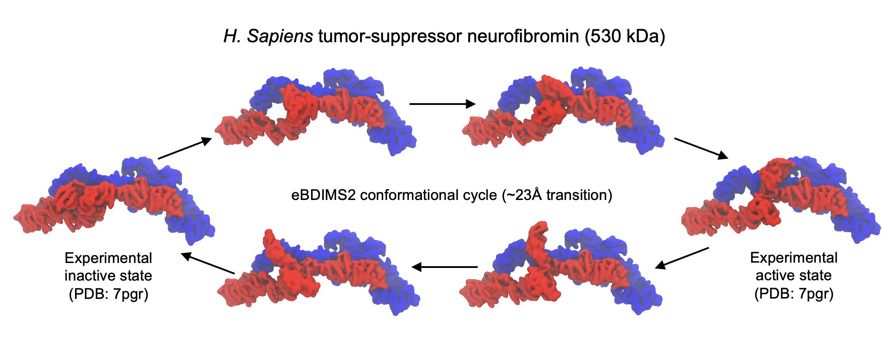

# eBDIMS2
Linux and MacOS codes to simulate transition pathways in proteins up to MDa scale with eBDIMS2.

All ensemble files and transition pathways that we simulated during the development and testing of the codes can be freely downloaded from figshare at: https://doi.org/10.6084/m9.figshare.28334204.v1

Animated GIFs of these protein transition pathways that can be also downloaded from https://doi.org/10.6084/m9.figshare.28334195.v1

Research paper available as preprint at https://www.researchsquare.com/article/rs-6504036/v1
