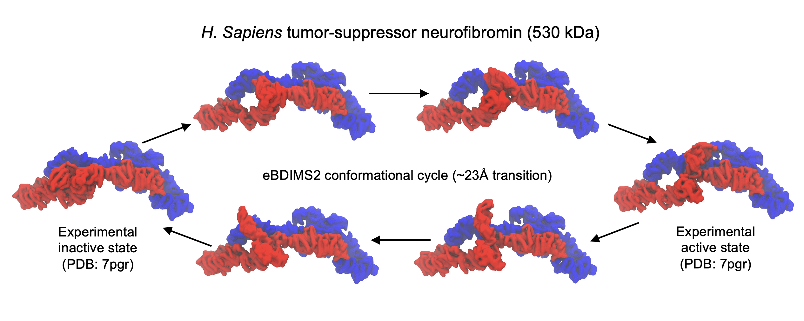

# eBDIMS2
Linux and MacOS codes to simulate transition pathways in proteins up to MDa scale with eBDIMS2.

Research paper available at https://www.nature.com/articles/s41467-026-69809-y

All ensemble files and transition pathways that we simulated, as well as animated GIFs, can be freely downloaded from figshare at https://doi.org/10.6084/m9.figshare.29423201.v1
